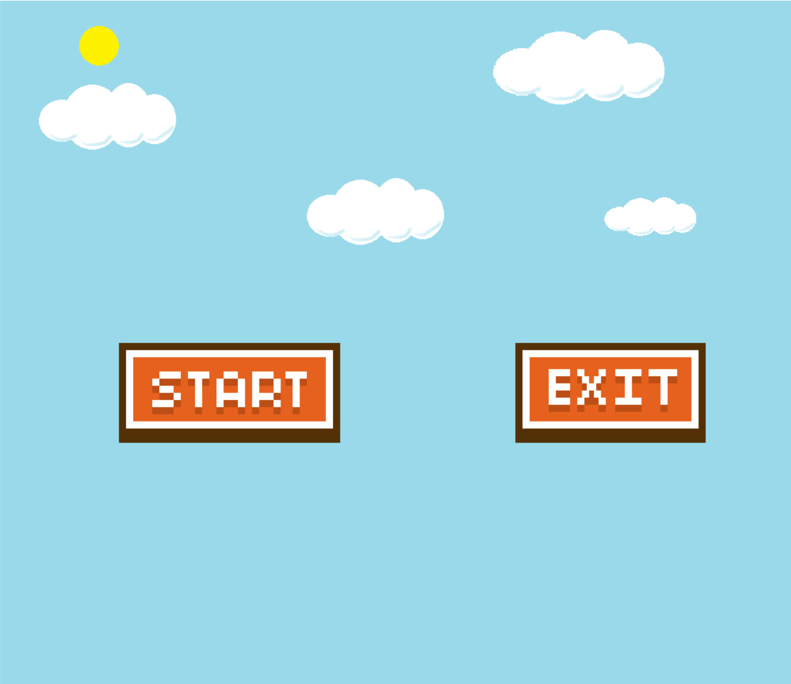
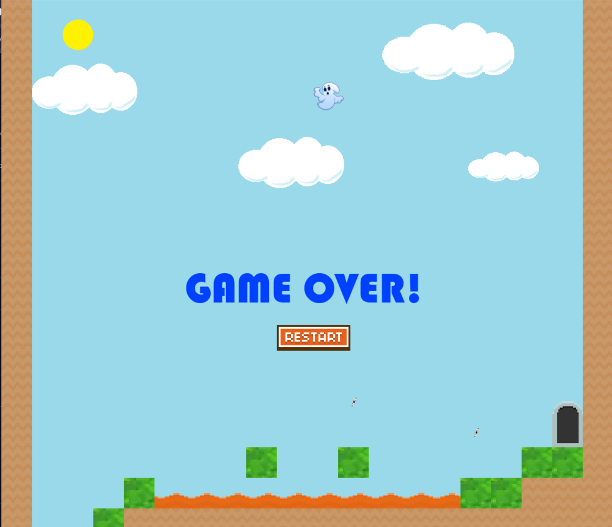

# ShinobiRun

A 2D platformer game developed in Python using the Pygame library. Navigate through multiple levels as a ninja character, avoiding enemies and obstacles while collecting points.

## 📋 Table of Contents

- [About](#about)
- [Features](#features)
- [Tech Stack](#tech-stack)
- [Installation](#installation)
- [How to Play](#how-to-play)
- [Project Structure](#project-structure)
- [Development](#development)
- [License](#license)

## 🎮 About

ShinobiRun is an action-packed platformer game where players control a ninja character through challenging levels filled with enemies, deadly lava pits, and platforms. The game features smooth animations, collision detection, and a progressive level system.

## ✨ Features

- **Player Movement & Animation**: Smooth character controls with walking animations
- **Multiple Levels**: Progress through 7+ different levels with increasing difficulty
- **Enemy AI**: Encounter enemies that patrol and threaten your progress
- **Environmental Hazards**: Navigate around lava and death zones
- **Collision Detection**: Precise platform and enemy collision mechanics
- **Score System**: Track your progress with a score counter and display
- **Start Menu**: Clean menu interface to begin your adventure
- **Sound Effects & Music**: Immersive audio experience (if implemented)
- **Platform Mechanics**: Moving platforms and static platform challenges
- **Save/Load System**: Level data saved for progress tracking

## 🛠️ Tech Stack

- **Language**: Python 3
- **Game Library**: Pygame
- **Development Environment**: Compatible with Windows, Mac, and Linux

## 📦 Installation

### Prerequisites

- Python 3.7 or higher
- Pygame library

### Setup Steps

1. Clone or download this repository:
```bash
git clone <repository-url>
cd Platformer-master
```

2. Install Pygame if not already installed:
```bash
pip install pygame
```

3. Run the game:
```bash
python level_editor.py  # To create/edit levels
python platformer       # To play the game (if executable)
```

## 🎯 How to Play

### Controls

- **Arrow Keys / WASD**: Move left and right
- **Space / Up Arrow**: Jump
- **ESC**: Pause/Menu

### Objective

- Navigate through each level while avoiding enemies and lava
- Reach the end of each level to progress
- Collect points and achieve the highest score possible
- Complete all levels to win the game

### Game Elements

- **Player**: Your ninja character
- **Enemies**: Avoid or defeat hostile characters
- **Lava**: Instant death zones
- **Platforms**: Static and moving platforms to navigate
- **Buttons**: Interact to trigger events or reset

## 📁 Project Structure

```
Platformer-master/
├── img/                                    # Game images and sprites
├── Part_1-Create_World/                    # Tutorial part 1
├── Part_2-Create_Player/                   # Tutorial part 2
├── Part_3-Walking_Animation/               # Tutorial part 3
├── Part_4-Collision/                       # Tutorial part 4
├── Part_5-Adding_Enemies/                  # Tutorial part 5
├── Part_6-Adding_Lava_and_Death/          # Tutorial part 6
├── Part_7-Add_Buttons_and_Reset_Game/     # Tutorial part 7
├── Part_8-Adding_a_Start_Menu/            # Tutorial part 8
├── Part_9-Multiple_Levels_and_Loading_Data/ # Tutorial part 9
├── Part_10-Add_Score_Counter_and_Display/ # Tutorial part 10
├── Part_11-Adding_Sound_Effects_and_Music/ # Tutorial part 11
├── Part_12-Moving_Platforms/              # Tutorial part 12
├── Part_13-Moving_Platform_Collision/     # Tutorial part 13
├── level_editor.py                         # Level editor tool (6 KB)
├── level0_data                             # Level 0 data file
├── level1_data                             # Level 1 data file
├── level2_data                             # Level 2 data file
├── level3_data                             # Level 3 data file
├── level4_data                             # Level 4 data file
├── level5_data                             # Level 5 data file
├── level6_data                             # Level 6 data file
├── level7_data                             # Level 7 data file
├── LICENSE                                 # License file
├── platformer                              # Main game executable
└── README.md                               # This file
```

## 🔧 Development

### Level Editor

The project includes a level editor (`level_editor.py`) for creating and modifying game levels:

```bash
python level_editor.py
```

Use the level editor to:
- Place platforms, enemies, and hazards
- Design level layouts
- Save level data for the main game

### Tutorial Parts

The project is organized into tutorial parts (Part_1 through Part_13), each focusing on a specific game mechanic:

1. **Create World**: Basic world setup and rendering
2. **Create Player**: Player character implementation
3. **Walking Animation**: Character animation system
4. **Collision**: Collision detection mechanics
5. **Adding Enemies**: Enemy implementation
6. **Adding Lava and Death**: Hazard mechanics
7. **Add Buttons and Reset**: UI and game reset functionality
8. **Adding Start Menu**: Menu system
9. **Multiple Levels and Loading Data**: Level management
10. **Add Score Counter and Display**: Scoring system
11. **Adding Sound Effects and Music**: Audio implementation
12. **Moving Platforms**: Dynamic platform mechanics
13. **Moving Platform Collision**: Advanced collision for moving platforms

## 📄 License

This project is licensed under the terms specified in the LICENSE file.

## 🙏 Acknowledgments

- Built with Pygame
- Tutorial-based development structure for learning game development

## 🐛 Known Issues

Please report any bugs or issues in the project's issue tracker.

## 🚀 Future Enhancements

- Additional levels
- Power-ups and collectibles
- Boss battles
- Multiplayer support
- Enhanced graphics and animations

---

**Enjoy playing ShinobiRun!** 🥷🎮




